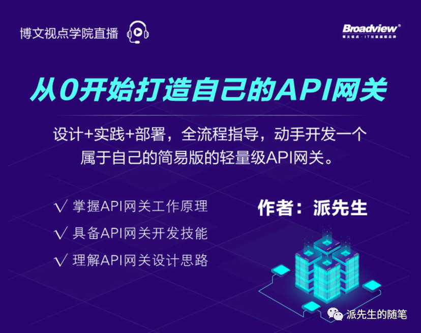
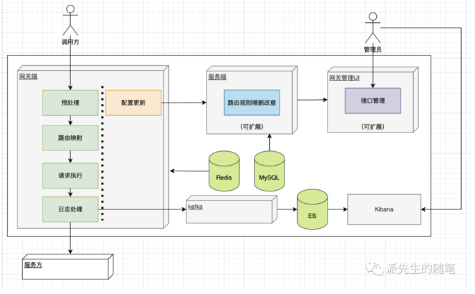
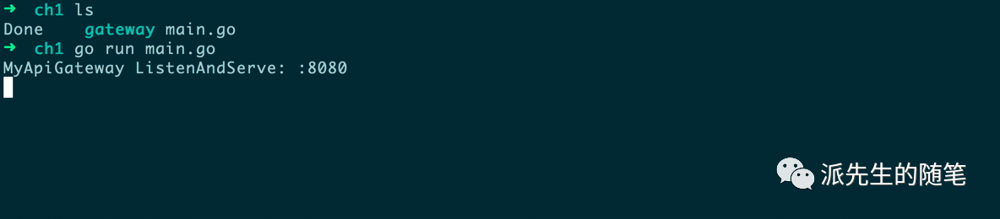
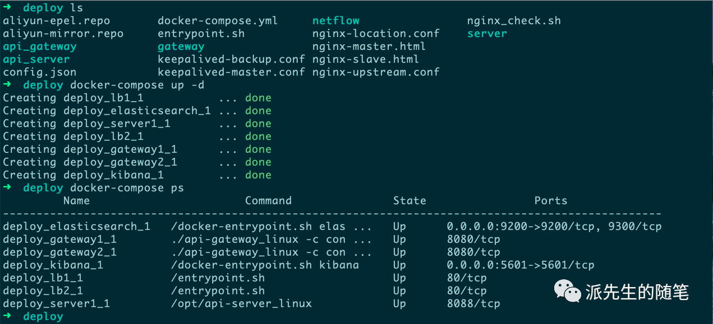

# 《从0开始打造自己的API网关》专栏代码
   




## 简介
apigatewaydemo 是一个基于[fasthttp](https://github.com/valyala/fasthttp)高性能Web服务框架构建的轻量级API网关演示项目。
它主要作为专栏课程的配套学习项目，帮助你从0开始学习API网关的开发实践，
并实现一个简易且完整的API网关，
它包含两个基础模块，网关端和服务端；其中网关端主要负责网络的联通和流量的转发，
服务端主要负责网关端的配置管理和配置下发， 项目中并未实现网关前端，感兴趣的同学也可以实践。
由于时间与精力有限，难免会有一些疏漏或不准确的地方，也非常欢迎指正和讨论。

## 功能
- [x] 路由转发
- [x] 负载均衡
- [x] 动态配置
- [x] 插件扩展
- [x] 日志管理

## 逻辑架构



## 安装
```shell
git clone github.com/imiyoo2010/apigatewaydemo
```

## 用法

### 代码目录

#### 设计篇
+ [【设计篇-1】API安全网关的架构设计](https://mp.weixin.qq.com/s?__biz=MzA5NTk5MzM1Ng==&mid=2656278355&idx=1&sn=2dfeeee20cec5974f69d2b15bbad88b4&chksm=8b11dc30bc665526b2b2826a85b673b7377887536d8b53d09a3746d17586a920ef18ba245ea0#rd)
+ [【设计篇-2】高性能技术方向的选择](https://mp.weixin.qq.com/s?__biz=MzA5NTk5MzM1Ng==&mid=2656278352&idx=1&sn=15346e5c274e48c1376706514d541d84&chksm=8b11dc33bc6655251cea7c0157c412133844bce973fbeb8cf34ef0cd68bc52f00ab57017151a#rd)
+ [【设计篇-3】如何实现网关的高可用](https://mp.weixin.qq.com/s?__biz=MzA5NTk5MzM1Ng==&mid=2656278438&idx=1&sn=c4538acd2675410b04d45c96f493f6a4&chksm=8b11dcc5bc6655d3fc91eef7db0008fcd1afba1f0013c3c222742e1ee807ab3ed68d1c5487f4#rd)

#### 实践篇
+ [【实践篇-1】网关框架：实现一个最小化的网关](https://mp.weixin.qq.com/s?__biz=MzA5NTk5MzM1Ng==&mid=2656278450&idx=1&sn=85d0886c54a3f4620a8817097fb865c7&chksm=8b11dcd1bc6655c797d6d95ec63bf7ec9f5443c17f90e6870ff14ce5b14af910e8e8216d01ca#rd) ||| [apigatewaydemo/ch1](https://github.com/imiyoo2010/apigatewaydemo/tree/main/ch1)
+ [【实践篇-2】路由转发：寻找你的服务信息](https://mp.weixin.qq.com/s?__biz=MzA5NTk5MzM1Ng==&mid=2656278451&idx=1&sn=555002d8089bb4db49f668e34c5c5f98&chksm=8b11dcd0bc6655c6489f53d5c6ba55bdc9b75f7b24675a958d643d08741e55f7c41e2a670b11#rd)
||| [apigatewaydemo/ch2](https://github.com/imiyoo2010/apigatewaydemo/tree/main/ch2)
+ [【实践篇-3】负载均衡：实现后端服务的高可用](https://mp.weixin.qq.com/s?__biz=MzA5NTk5MzM1Ng==&mid=2656278452&idx=1&sn=48fceefeaa4d004a9b62b2a46ddcf3ff&chksm=8b11dcd7bc6655c17c7a0a49116b2241fe88f312add4985febc2e4b00b6eef1ac7f643ef8b63#rd)
||| [apigatewaydemo/ch3](https://github.com/imiyoo2010/apigatewaydemo/tree/main/ch3)
+ [【实践篇-4】插件扩展：增强网关的功能扩展 ](https://mp.weixin.qq.com/s?__biz=MzA5NTk5MzM1Ng==&mid=2656278453&idx=1&sn=9859105504b42daa15aaf487961463d8&chksm=8b11dcd6bc6655c0752f4143673025b6f1586307de763cf26be01df7c375154d7a1a56106c8e#rd)
||| [apigatewaydemo/ch4](https://github.com/imiyoo2010/apigatewaydemo/tree/main/ch4)
+ [【实践篇-5】动态配置：实现网关的配置更新](https://mp.weixin.qq.com/s?__biz=MzA5NTk5MzM1Ng==&mid=2656278454&idx=1&sn=07b5dace12c70dee5faa0fa8a8449925&chksm=8b11dcd5bc6655c3b1c12a6ec26cffc86f789e80c408b9b6306661da0198a68ed35045fbaac1#rd)
||| [apigatewaydemo/ch5](https://github.com/imiyoo2010/apigatewaydemo/tree/main/ch5)
+ [【实践篇-6】日志管理：实现网关的日志功能](https://mp.weixin.qq.com/s?__biz=MzA5NTk5MzM1Ng==&mid=2656278455&idx=1&sn=a8489ce1a706e8f62c51c212f928f475&chksm=8b11dcd4bc6655c242b2c10e8724db1bcdb5dee600720228e9a3fda5715578fb25f1df9d8b92#rd)
||| [apigatewaydemo/ch6](https://github.com/imiyoo2010/apigatewaydemo/tree/main/ch6)

#### 部署篇
+ 项目代码 [apigatewaydemo/demo](https://github.com/imiyoo2010/apigatewaydemo/tree/main/demo)
+ 部署代码 [apigatewaydemo/deploy](https://github.com/imiyoo2010/apigatewaydemo/tree/main/deploy)
+ [【部署篇-1】打包发布：发布你的网关程序](https://mp.weixin.qq.com/s?__biz=MzA5NTk5MzM1Ng==&mid=2656278456&idx=1&sn=bb79bd6306cc7a07fce56f4b6e130332&chksm=8b11dcdbbc6655cd28f8a82b479dcc979e4519e86bb2c4750d9ea2c0de17b42aef1210288fcc#rd)
+ [【部署篇-2】网关优化：提高网关的处理性能](https://mp.weixin.qq.com/s?__biz=MzA5NTk5MzM1Ng==&mid=2656278470&idx=1&sn=a6ecd47bdd6b70fa4d7df6f057af3a6c&chksm=8b11dca5bc6655b3a5f8220e19672ac6043e13813d393d4dcf9b34b8907f0bfdea7e93e0e25f#rd)
+ [【部署篇-3】性能测试：看看网关的性能指标](https://mp.weixin.qq.com/s?__biz=MzA5NTk5MzM1Ng==&mid=2656278457&idx=1&sn=34d68683d3d619353d66b0d8d19655d1&chksm=8b11dcdabc6655ccee808d45fad32d908e73924127e947adbe2f6a519c7019e169abafc2bd00#rd)
+ [【部署篇-4】部署运行：用Docker部署你的网关](https://mp.weixin.qq.com/s?__biz=MzA5NTk5MzM1Ng==&mid=2656278471&idx=1&sn=cccd8437cae93fcf755633734a62fee1&chksm=8b11dca4bc6655b25c3e6e7bcdc39d2b1068b68207f8b1010342bfa5f6bb1eedde0f25f64ea6#rd)

### 代码运行
**项目代码**
```shell
cd ch1
go run main.go
```


**部署代码**
```shell
cd deploy
docker-compose up -d
```


## 联系

+ 公众号:派先生的随笔
+ github: http://github.com/imiyoo2010
+ 邮箱: imiyo2010#gmail.com
+ 博客: http://i.imiyoo.com
+ 知识星球：安全行动派


## 协议
[MIT License](https://github.com/imiyoo2010/apigatewaydemo/blob/main/LICENSE)
